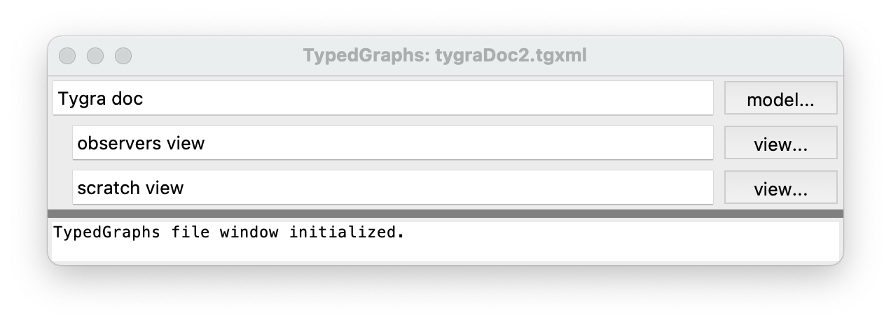

tygra Concepts
==============

.. contents::
   :local:
   :backlinks: none

Nodes and Relations
-------------------

The fundamental idea behind tygra is the *graph*. That is, using a collection of *nodes* (boxes) and
connecting *relations* (lines) to express information. For many things, using this nonlinear method
of expression is more useful than linear text (see Fig. 1). Nodes and relations are called *nodes* and *edges*
in graph theory, but here we prefer to use the the term *relation* rather than *edge* because we
are using *type theory* here. (Which is somewhat similar to *colored graphs* in graph theory.)  In
*tygra*\ , relations have a "handle" with a label. so they might *look* similar to nodes, but we think
of them as a labeled line.  In Fig. 1, the objects labeled "ISA" and "RANK" are just the labeled handles
on relations (line). 

.. figure:: images/life.png
   :align: center
   :alt: Screenshot of a tygra view window (displaying a view of the above model)
   :scale: 35%
   :figwidth: 100%
   
   Fig. 1: Screenshot of a tygra view window showing part of a graph about biological classification.

.. _concepts.types:

Types
-----
 
One of the things that differentiates *tygra* from simple drawing tools is that both nodes and relations
are *typed*. That is, All nodes and relations *inherit* properties from their ancestor nodes and relations
(except for the top-level node "T" and the top-level relation "REL". Usually, relations connect from
one node to another node (first-order, eg: "John--owns->aDog), but it's also possible to have relations 
between relations, which allows us
to represent things in higher-order logics (eg: ancestor--subsumes->parent, where *ancestor* and 
*parent* are relations). But it is **not** possible to have a relation between a node and a relation.
Nodes and relations are very distinct from one another. 

You specify types in *tygra* by drawing an *ISA* relation (a special relation) from the subtype to 
it's supertype. This is done by right clicking on the subtype node, selecting "relation" and then 
"ISA" from the popup menu, and then drawing the ensuing elastic line to the supertype node. 

Types and Individuals
^^^^^^^^^^^^^^^^^^^^^

In addition, *tygra* makes a distinction between *types* and *individuals* (or *instances*\ ). 
For example, you cannot draw
an *ISA* relation **to** an individual. (But **from** an individual is fine, of course.) For example,
Mary is a Person, but there's no (reasonable) circumstance where where Alice is a Mary [#F0]_.  

Types and
individuals are distinguished by a checkbox in the attributes editor for each node and relation and also
types are marked by a small circled "T" at the top left-hand corner of it's shape.

Layout
------

You can move nodes around by dragging them.  The relation lines will stretch to follow and the handles on
relations will move to approximately center themselves between their terminal objects, at least of they
area *floating*.  Relation handles can be *floating* or fixed.  
If you drag a relation handle, it automatically
becomes fixed.  You can use it's right-click menu to make it floating again.  

You will notice is you drag or otherwise
cause two or more objects to overlap, they may move on their own to non-overlapping positions.  This 
behaviour is controlled by "local layout" choices on the view's background right-click menu. You may 
choose from several styles like "find free", "find free (tight)", and "nudge". There's also an option
to suppress local layout.

While it's nice that you
can arrange a graph in any way you like, when the graph becomes large, this can because tedious or 
confusing.  You can request *tygra* to layout the entire graph in various ways by using the "global layout"
menu on the background right-click menu.  Choices include "ISA hierarchy (vert)" and "ISA hierarchy (horz)",
which both you use the *ISA* relations to organize the nodes in a subsumption lattice (vertically and horizontally
respectively). More layout hueristics will be added later.

Models and Views
----------------

*Tygra* conforms to a model/view pattern. Fig. 3, below, shows a *tygra* file menu showing a file with a 
single abstract model, "Tygra doc", and two views of that model, "observers view" and "scratch view". 
The views can never show anything that isn't in the model, but they may not necessarily (and seldom do) show
everything that's in the model. For each model there can be any number of views, but each view can only
represent a single model [#f1]_\ .

   
   Fig. 3: Screenshot of a tygra file window (displaying some info about tygra iteself).

The model is abstract, so the only way for the user to edit the model is by use of a view.  In a view, you 
can create new nodes in the model by using the background right-click menu's "new node" option. This will give you the 
option of creating nodes of various types. As previous said, types are described only by *ISA* relations, so
when you are creating a node in this way, you are really creating a node and an *ISA* relation (pointing from
your new node to a type node of the type you want your new node to be.  You are free, of course to change
the type of the new node by deleting and creating *ISA* relations rooted on the new node. *Tygra* will impose
some restrictions on what *ISA* relations you can draw, however.  For example, it will not allow you to 
create cycles of *ISA* relations. 
A node may be more than one type if it has more than one *ISA* relations emerging from it.

Once a model is created and populated, you may explore the model from a view by expanding a node of relation that's
already in the view by using that node's (or relation's) right-click menu option "expand" or "expand all", which
will draw in all (or some of) the node's immediate neighbours in the model and the relations connecting them.
Repeating this process, one can quickly explore then entire model [#f2]_\ .

.. rubric:: Footnotes

.. [#f0] Mary might have an alias "Alice", but that's a different thing.

.. [#f1] A least for now. In the future I may extend views so that they can include data from more than
   one model.

.. [#f2] Although you wouldn't necessarily want to --
   I have one graph, modeling my home control system, that has almost 10,000 nodes and relations in the model. This one was
   programmatically generated from the home control database.

