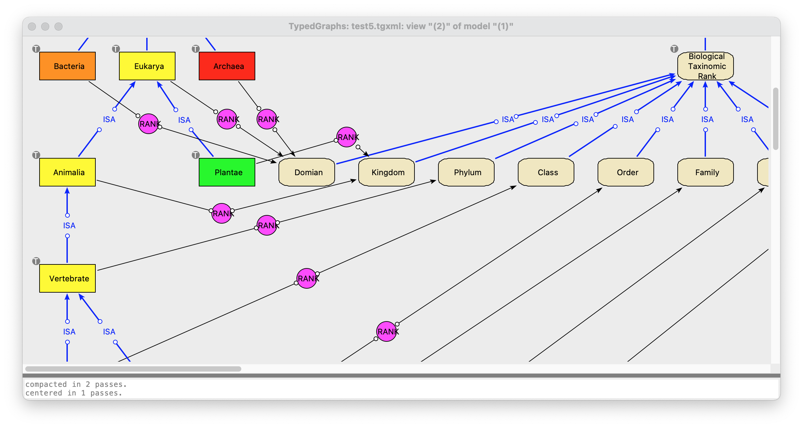

tygra Concepts
==============

.. contents::
   :local:
   :backlinks: none

Nodes and Relations
-------------------

The fundamental idea behind tygra is the *graph*. That is, using a collection of *nodes* (boxes) and
connecting *relations* (lines) to express information. For many things, using this nonlinear method
of expression is more useful than linear text (see Fig. 1). Nodes and relations are called *nodes* and *edges*
in graph theory, but here we prefer to use the the term *relation* rather than *edge* because we
are using *type theory* here. (Which is somewhat similar to *colored graphs* in graph theory.)  In
*tygra*\ , relations have a "handle" with a label. so they might *look* similar to nodes, but we think
of them as a labeled line.  In Fig. 1, the objects labeled "ISA" and "RANK" are just the labeled handles
on relations (line). 

   
   Fig. 1: Screenshot of a tygra view window showing part of a graph about biological classification.

Types
-----
 
One of the things that differentiates *tygra* from simple drawing tools is that both nodes and relations
are *typed*. That is, All nodes and relations *inherit* properties from their ancestor nodes and relations
(except for the top-level node "T" and the top-level relation "REL". Usually, relations connect from
one node to another node (first-order, eg: "John--owns->aDog), but it's also possible to have relations 
between relations, which allows us
to represent things in higher-order logics (eg: ancestor--subsumes->parent, where *ancestor* and 
*parent* are relations). But it is **not** possible to have a relation between a node and a relation.
Nodes and relations are very distinct from one another. 

You specify types in *tygra* by drawing an *ISA* arc from the subtype to it's supertype. This is done
by right clicking on the subtype node, selecting "relation" and then "ISA" from the popup
menu, and then drawing the ensuing elastic line to the supertype node. 