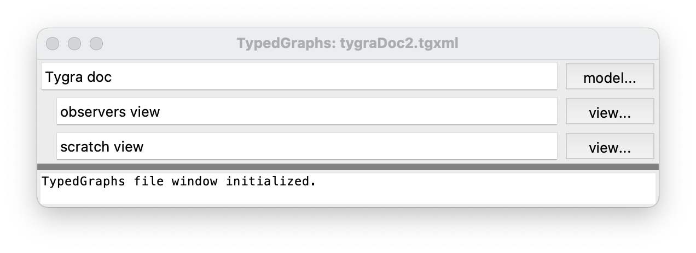

Developer's Documentation
=========================

Contents (:doc:`Detailed contents <contents2>`)
-----------------------------------------------

.. toctree::
   :maxdepth: 1
   
   typedgraphs
   mobjects
   mnodes
   mrelations
   vobjects
   vnodes
   vrelations
   attributes
   relationproperties
   layout
   app
   util
   loggingPanedWindow
   weaklist
   tooltip

Indices and tables
==================

* :ref:`genindex`
* :ref:`modindex`
* :ref:`search`

What is tygra?
==============

*Tygra* is a visual graph editor ("graph" as in nodes and edges), where a node is called
a *node* and an edge is called a *relation*.  Nodes and relations are typed in that
there types dictate thier *attributes* such as fill colour, border colour, text colour,
shape, aspect ratio, and minimum size as well as thier properties such the tranitive,
symetric, and reflexive properties or relations. 

The type of a node or relation is
specified by drawing an *ISA* relation from the subsumed node or relation to the
subsuming node or relation (where the subsumming node or relation must have the
*type* property).

   
   Fig. 1: Screenshot of a tygra file window (displaying some info about tygra iteself).

Because graphs can become large and complicated quickly, *tygra* follows the 
model/view pattern.  A model is a semantic description of a graph, containing all
the nodes (and thier attributes such as label, various colours, shape) and
relations between the nodes (and the relations themselves).  For each model
there is one or more views which reference the single model, and may contain
all, or just some of, the model's nodes and relations. Views contain only 
syntactic information such as which nodes and relations are displayed and
thier locations on the view canvas.  

   
   Fig. 2: Screenshot of a tygra view window (displaying a view of the above model)

